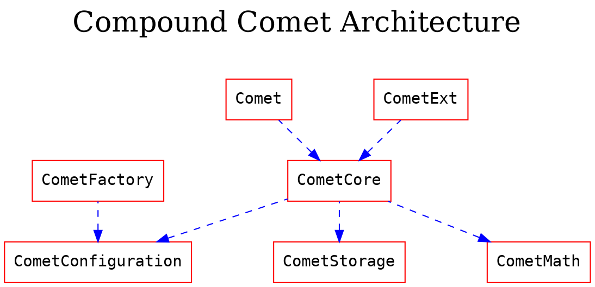

## Verification Overview
The current directory contains Certora's formal verification of Compound's Comet protocol.
In this directory you will find four subdirectories:

1. specs - Contains all the specification files that were written by Certora for the Comet protocol. The rules are generally divided into sub-efforts that focus on proving specific functionalities, e.g. `cometAbsorbBuyCollateral.spec` focuses on verifying properties that involve the absorption and buy collateral functionalities, etc.
The directory also features a `timeout.spec` file, which contains rules that do not return a definite result due to timeouts, and 2 `setup_xxx.spec` files that contain declarations and safe simplifications.

2. scripts - Contains all the necessary run scripts to execute the spec files on the Certora Prover. These scripts composed of a run command of Certora Prover, contracts to take into account in the verification context, declaration of the compiler and a set of additional settings. Each script is named after spec it verifies.

3. harness - Contains all the inheriting contracts that add/simplify functionalities to the original contract. You will also find a set of symbolic and dummy implementations of external contracts on which `Comet.sol` relies.
These harnesses, i.e. extensions/simplifications, are necessary to run the verifications. Most simplifications are a safe approximation, e.g., proving their correctness first, then simplifying them to reduce computational complexity. Assumptions and under-approximations are also done in a few places, in order to supply partial coverage where full coverage is not achievable.

4. erc20 - Contains a scaffold specification for ERC20 tokens which can be thickened and improved by defining the desired properties. This verification effort is aimed as a preemptive measure - it allows to verify certain desired properties of an ERC20 token before enlisting it in the system.
We've added scripts for running the spec on 3 common tokens deployed on mainnet - USDC, Sushi and FTT - as a demo.
The idea is to get thorough inspection of each token of interest and see if and which properties are violated and whether we trust it enough to enlist it as a base/collateral token in the Comet protocol. More on that can be found [here](erc20/Readme.md) and [here](#FormalPropertiesForERC20)

All `.sol` and `.spec` files are well documented. Every assumption, simplification and approximation are written in the relevant place, and should be considered when reviewing the results.

</br>

---

## Running Instructions
To run a verification job:

1. Open terminal and `cd` your way to the `certora` directory in the Comet repository.

2. `touch` the `applyHarness.patch` file to make sure its last modification timestamp is later than your contracts:
    ```sh
    touch applyHarness.patch
    ```

3. Execute the `munged` command in the make file to copy the contracts to the munged directory and apply the changes in the patch:
    ```sh
    make munged
    ```

4. `cd` your way back to to the main Comet directory.

5. Run the script you'd like to get results for:
    ```sh
    sh certora/scripts/verifyInterestComputation.sh
    ```

* You can also run the script `verifyAll.sh` to run all the scripts consecutively. 

</br>

---

## Overview of Comet protocol 
Compound Comet is a protocol that allows supplying volatile assets as collateral, and borrowing only a single (e.g. stable) coin.

The system pre-defines 2 sorts of tokens:

- **Base Token** - A single token, most likely a stable coin, that can be borrowed from or supplied to the system with interest determined by parameters of the system.

- **Collateral Token** - Up to 16 distinct ERC20 assets, most likely volatile coins/tokens, that can be supplied as collateral against a loan.

The protocol has a distinct borrow and supply rate curves for the borrowed token.

In the event a borrower's collateral does not cover its current debt, a 2 step absorption mechanism is provided. Absorption can be executed by anyone:

- **Step 1** - Once a user (Alice) is in a liquidatable state, any user in the system (including Alice herself) can call `absorb()` on her. The absorption sorts out Alice's balance sheet by giving up her debts while absorbing all of her collateral assets **to the system**. The user that successfully called `absorb()` receives `LiquidatorPoints`.

- **Step 2** - Now that Alice's account is balanced, and her collateral has been absorbed into the system, the collateral is available for anyone to buy for a discount.

<div id="Compound_Comet_Architecture">
    

    
</div>

As the goal of Comet is to be highly optimized for a particular use case, it seeks to minimize the number of contracts involved. The protocol is implemented primarily in a monolithic contract.

## Contract Functions

### Supply
Serves three distinct purposes:
1. Supply liquidity in Base tokens
2. Supply collateral in volatile assets
3. Return borrowed Base tokens

### Withdraw
Serves three distinct purposes:
1. Withdraw liquidity in Base tokens
2. Withdraw collateral
3. Borrow Base tokens

### getSupplyRate
Returns the actual interest rate promised to liquidity providers. The rate is a function of liquidity utilization, interest rate slope and a reserve scaling factor.

### getBorrowRate
Returns the actual interest rate the borrowers should expect. The rate is a function of liquidity utilization and interest rate slope.

### getUtilization
Returns the rate of the utilization, or the rate of efficiency in utilizing the liquidity.

### getReserves
Returns the amount of reserves left in the system.
The protocol designates a part of the supplied liquidity and a part of the accumulated interest to the reserves. These reserves are then used in special cases, for example when the borrower fails to comply with the collateral obligations and the loan has to be liquidated.

### withdrawReserves
Withdraws remaining base token reserves, if called by the governor. 

### isBorrowCollateralized
Recalculates the present value of the borrower's collateral and the present value of the borrowed amount then evaluates them with respect to the protocol's collateralization policy.

### isLiquidatable
Recalculates the present value of the borrower's collateral and the present value of the borrowed amount then evaluates them with respect to the protocol's liquidation policy.

### absorb
Liquidates a loan and transfers the remaining collateral to the contract. A user may call absorb if `isLiquidatable = true`.

### buyCollateral
Allows a user to buy the "absorbed" collateral from the system by providing the appropriate amount of Base tokens.

### transferAsset
Allows user A to transfer his assets stored in the system to user B so long as those assets do not serve as collateral.

### accrueInternal (internal function)
An important function that updates the aggregated interest rates for suppliers and for the borrowers.

</br>

---

## Verified Contracts

In order to have a better coverage of the system, and due to computational complexities that arise in the process of verifying a system as complex as Comet, some harnesses to the original contract were required.
The harnesses contain additional or modified functionalities for the original contract.
We've split our harnesses into several levels of modifications, which allows for greater control in determining which rule is verified under which conditions and assumptions. All harnesses inherit from the original contract they modify.

</br>

#### CometHarnessGetters
A collection of getters that otherwise would be invisible to the SPEC file.

</br>

#### CometHarnessWrappers
A collection of functions that wrap the source code functions and data structures that otherwise would be invisible to the SPEC file. (for example : internal functions).

</br>

#### CometHarness
A collection of summarizations and simplifications of methods and components of comet.
Some summarizations are safe approximations as important properties have been proven on the original code. For example: replacing the extensively bitwise operation functions `isInAsset` with a simpler but semantically equivalent summarization. Since `isInAsset` have been proven to be correct with respect to a set of properties this simplification is a safe approximation. However some simplifications are under-approximation as they don't take into account all possible states of the contract. 

The following table describe which spec file runs on which harness contract and which setup spec, to give a better sense of the assumptions and simplifications that were used in the verification of these specific rules:

| Spec                      | Harness used         | spec import               |
| ------------------------- | -------------------- | ------------------------- |
| `assetInfo`                 | `CometHarnessWrappers` | `setup_noSummarization`    |
| `comet`                     | `CometHarness`         | `setup_cometSummarization` |
| `cometAbsorbBuyCollateral`  | `CometHarness`         | `setup_cometSummarization` |
| `cometExt`                  | \-                   | \-                        |
| `cometTotalsAndBalances`    | `CometHarness`         | `setup_cometSummarization` |
| `cometWithdrawSupply`       | `CometHarness`         | `setup_cometSummarization` |
| `governance`                | `CometHarnessGetters`  | \-                        |
| `interestComputation`       | `CometHarnessWrappers` | `setup_noSummarization`    |
| `pause`                     | `CometHarnessGetters`  | `setup_noSummarization`    |
| `pauseGuardians`            | `CometHarnessGetters`  | \- 
| `timeouts`                  | `CometHarnessWrappers` | `setup_noSummarization`    |
| `userAssetIn`               | `CometHarnessWrappers` | `setup_noSummarization`    |

## Assumptions and simplifications made during verification

We made the following assumptions during our verification:

- When verifying contracts that make external calls, we assume that those calls can have arbitrary side effects outside of the contracts, but that they do not affect the state of the contract being verified. This means that some reentrancy bugs may not be caught.

- We unroll loops. Violations that require a loop to execute more than twice will not be detected.

Some rules are proven over the following set of simplified assumptions:

- The `accrue` method does not change any value - specifically the supply and borrow rate

- The supply and borrow rate are kept constant at the initial value

- Base scale set to Factor scale
 
- `AccrualDescaleFactor` and `trackingIndexScale` are both 1
 

## Notations

✔️ indicates the rule is formally verified on the latest reviewed commit. We write ✔️* when the rule was verified on the simplified assumptions described above. 

❌ indicates the rule was violated under one of the tested versions of the code.


🔁 indicates the rule is timing out.

We use Hoare triples of the form {p} C {q}, which means that if the execution of program C starts in any state satisfying p, it will end in a state satisfying q. p and q are analogous to require and assert in Solidity. 

The syntax {p} (C1 ～ C2) {q} is a generalization of Hoare rules, called relational properties. {p} is a requirement on the states before C1 and C2, and {q} describes the states after their executions. Notice that C1 and C2 result in different states. As a special case, C1～op C2, where op is a getter, indicating that C1 and C2  result in states with the same value for op.

    
## Verification of Comet

This section details the verification of Comet.
Over fifty properties are defined for Comet. the properties are separated into sections, starting with the high-level properties. 
In addition, a methodology for checking reentrancy safety has been applied to verify the unlikely case of a call back from an ERC20 contract.
Lastly, a set of properties for listing ERC20 assets are formally defined and can be easily applied on any ERC20 contract. 


### High level properties of the system
###### files comet.spec, cometTotalsAndBalances.spec

1. **Total collateral per asset** ✔️*
The sum of collateral per asset over all users must equal the total collateral for that asset
 ```
 sum(userCollateral[user][asset].balance) = totalsCollateral[asset].totalSupplyAsset
 ```
2. **Total asset collateral vs asset balance** ✔️*
The total supply of an asset must not exceed the contract's balance for that asset.
```
totalsCollateral[asset].totalSupplyAsset ≤ asset.balanceOf(this)
```
3. **Base balance vs totals** ✔️*
The base token balance of the system must be at least as large as the total supply of base tokens minus the total base tokens borrowed
```
baseToken.balanceOf(currentContract) ≥ getTotalSupplyBase() - getTotalBorrowBase()
```
4. **Collateral totalSupply LE supplyCap** ✔️*
The total supply of an asset must not be greater than its supply cap
```
 totalsCollateral[asset].totalSupplyAsset ≤ getAssetSupplyCapByAddress(asset)
```
5. **Total base token** ✔️*
The sum of principal balances over all users must equal the total base token within the system
```
sum(userBasic[user].principal) == totalsBasic.totalSupplyBase - totalsBasic.totalBorrowBase
```
6. **Balance change by allowed only** ✔️*
A user's principal balance may decrease only by a call from them or from a permissioned manager
```
    {
        x = userBasic[user].principal ∧
        b = userCollateral[user][asset].balance ∧
        p = hasPermission[user][msg.sender] 
    }

    < call op() by msg.sender>

    {
        ( userBasic[user].principal < x  ⇒ ( user = msg.sender v p ) ) ∧
        userCollateral[user][asset].balance < y ⇒ ( user = msg.sender v p  v op=absorb )	                  
    }
```
7. **Collateralized after operation** ✔️*
 Any operation on a collateralized account must leave the account collateralized
 ```
    {
        isBorrowCollateralized(t, user)
    }

    < call op() at time t >

    {
        isBorrowCollateralized(t, user)
    }
 ```
8. **AssetIn initialized with balance** ✔️*
The assetIn switch of a specific asset must be initialized along with the collateral balance
```
userCollateral[user][asset].balance > 0 ⇔ isInAsset(userBasic[user].assetsIn, asset.offset)
```
9. **Balance change vs accrue** ✔️* 
Base balance must change only on updated accrued state
```
    {
        balance_pre = tokenBalanceOf(_baseToken,currentContract)
    }

        < call any function >

    {
        balance_pre ≠ tokenBalanceOf(_baseToken,currentContract) ⇒ accrueWasCalled()
    }
```
10.  **Balance change vs registered** ✔️*
A change in the system's balance of some asset must only occur for assets registered as recognized assets
```
    {
        registered = getAssetInfoByAddress(token).asset == token ∧
        token ≠ _baseToken ∧ 
        b = tokenBalanceOf(token,currentContract)
    }

        < call any function >

    {
        tokenBalanceOf(token,currentContract) ≠ b ⇒ registered

    }
```
11. **Usage registered assets only** ✔️*
Every function that has an asset argument must revert on a non-registered asset.
```
    {
        
    }

        < call any function with asset >

    {
        getAssetInfoByAddress(asset).asset == asset 
    }
```
12. **Verify transferAsset** ✔️*
A transfer must not change the combined presentValue of src and dst
```
    { 
        p = baseBalanceOf(src) + baseBalanceOf(dst) ∧
        c = getUserCollateralBalance(asset, src) + getUserCollateralBalance(asset, dst) 
    }

    transferAssetFrom(src, dst, asset, amount)

    {
        baseBalanceOf(src) + baseBalanceOf(dst) = p ∧
        getUserCollateralBalance(asset, src) + getUserCollateralBalance(asset, dst)  = c
    }
```

### Properties regarding withdraw and supply
###### files cometAbsorbBuyCollateral.spec
13. **Withdraw reserves decreases** ✔️*
When a manager withdraws from the reserves, the system's reserves must decrease
```
    {
        before = getReserves()
    }

        withdrawReserves(to,amount)
    
    {
        amount > 0 ⇒ getReserves() < before 
    }
```
14. **Withdraw reserves monotonicity** ✔️*
The larger a withdrawal from reserves a manager makes, the smaller the remaining reserves in the system must be
```
    {
        
    }
     
    withdrawReserves(x); r1 = getReserves()
    ~ 
    withdrawReserves(y); r2 = getReserves()
    
    {
        x > y ⇒ r1 > r2
    }
```
15. **Supply increase balance** ✔️*
If a certain amount of an asset is supplied, the balance of that asset must increase by that amount
```
    {
        balance1 = tokenBalanceOf(asset, currentContract)
    }
    
        supply(asset, amount)
    
    {
        tokenBalanceOf(asset, currentContract) - balance1 == amount
    }

```
16. **Withdraw decrease balance** ✔️*
If a certain amount of an asset is withdrawn, the balance of that asset must decrease by that amount
```
    {
        b = tokenBalanceOf(asset, currentContract)
    }
    
    withdraw(asset, amount)
    
    {
        b - tokenBalanceOf(asset, currentContract) == amount
    }

```
17. **Additivity of withdraw** ✔️*
Performing two distinct withdrawals must result in the same outcome as performing a single withdrawal for the same total amount
```
    {
        
    }
    
    withdraw(Base, x); withdraw(Base, y) ; base1 := baseBalanceOf(e.msg.sender)
    ~
    withdraw(_baseToken, x + y); base2 := baseBalanceOf(e.msg.sender)
    
    {
        base1 == base2
    }
```

### Properties regarding absorb and buyCollateral
###### files: cometAbsorbBuyCollateral.spec
18. **Anti monotonicity of buyCollateral** ✔️*
After a call to buy collateral:
        (i) the collateral balance must decrease 
        (ii) the Base balance must increase 
        (iii) the Base balance must increase if and only if the collateral balance decreases
```
    {
        balanceAssetBefore = tokenBalanceOf(asset, currentContract)     ∧
        balanceBaseBefore = tokenBalanceOf(_baseToken, currentContract)
    }
    
        buyCollateral(asset, minAmount, baseAmount, recipient)
    
    {
        tokenBalanceOf(asset, currentContract) ≤ balanceAssetBefore        ∧
        balanceBaseBefore ≤ tokenBalanceOf(_baseToken, currentContract)    ∧
        ( balanceBaseBefore < tokenBalanceOf(_baseToken, currentContract) ⇔ 
            tokenBalanceOf(asset, currentContract) < balanceAssetBefore )
    }
```
19. **BuyCollateral max** ✔️*
 After absorb, user's collateral is added to Contract's collateral.
One cannot buy more collateral than contract's collateral
```
     {
        max = getUserCollateralBalance(currentContract, asset)
        balanceAssetBefore = tokenBalanceOf(asset, currentContract)
    }
    
        buyCollateral(asset, minAmount, baseAmount, recipient)
    
    {
        tokenBalanceOf(asset, currentContract) ≥ balanceAssetBefore - max
    }
```

20. **Cannot absorb same account** ✔️*
If the array of accounts has the same account twice then absorb should revert

```
    {
        accounts[0] == account ∧ accounts[1] == account
    }
        absorb@withrevert(absorber, accounts)
    {
        lastReverted   
    }
```
21. **Absorb reserves decrease** ✔️*
After absorption of account, the system's reserves must not increase
```
    {
        pre = getReserves()
    }

        absorb(absorber, accounts)
    
    {
        getReserves() ≤ pre
    }
```
22. **Anti monotonicity of absorb** ✔️*
On absorb, as the collateral balance increases the total BorrowBase decreases
```
    {
        balanceBefore = getUserCollateralBalance(this, asset),
        borrowBefore = getTotalBorrowBase()
    }
    
        absorb(absorber, accounts)
    
    {
        getUserCollateralBalance(this, asset) > balanceBefore ⇒ 
            getTotalBorrowBase() < borrowBefore
    }
```
23. **Cannot double absorb** ✔️*
The same account cannot be absorbed repeatedly
```
    {
        
    }
        absorb(absorber, accounts); 
        absorb@withrevert(absorber, accounts)
    
    {
        lastReverted
    }
```

### Properties regarding setting allowance
###### files: cometExt.spec

24. **Allowance only zero or max** ✔️
Spender's allowance may only be equal to 0 or to max_uint256
```
allowance[owner][spender] == 0 v allowance[owner][spender] == max_uint256
```

25. **Approve fails on invalid allowance** ✔️
Trying to approve an allowance which is not 0 or max_uint should fail
```
        { 
            0 < amount < max_uint256
        }
        
          approve(spender, amount) 

        {
            lastReverted 
        }
```
26. **Valid allowance changes** ✔️
 Allowance changes only as a result of approve(), allow() and allowBySig().
Allowance changes for non msg.sender only as a result of allowBySig()
```
    { 
        allowanceBefore = allowance[owner][spender] 
    }

        < call any function f >

    { 
        allowanceAfter = allowance[owner][spender] ∧
        allowanceBefore ≠ allowanceAfter ⇒ ( f == approve v f == allow v f == allowBySig )
    }
```
27. **Valid approve succeeds** ✔️
Approve with a valid amount (0 or max_uint256) succeeds
```
   { 
        amount = 0 v 
        amount = max_uint256
    }

        approve(spender, amount)

    {
        ¬lastReverted
    }
```
## Properties regarding governance methods
###### files: governance.spec, pause.spec, pauseGuardians.spec
28. **Methods pause and withdrawReserves may be called only by governor or by pauseGuardian** ✔️
```
    { 

    }
        < call to pause() or withdrawReserves() >

    { 
        ¬lastReverted ⇒ (msg.sender = governor) v 
                        (msg.sender = pauseGuardian)
    }
```
29. **Ability to updates flag** ✔️
Method pause reverts if only if the sender is not governor or pause guardian
```
    {

    }
        pause()
    {
        lastReverted ⇔ (msg.sender ≠ governor) ∧ 
                       (msg.sender ≠ pauseGuardian)
    }
```
30. **Integrity of flag updates** ✔️
After an update the getters retrieve same values as arguments to pause
```
    {

    }

    pause(supplyPaused, transferPaused, withdrawPaused, absorbPaused, buyPaused)

    {
        ¬lastRevert ⇒ ( supplyPaused = supplyPaused() ∧
                        transferPaused = isTransferPaused() ∧
                        withdrawPaused = isWithdrawPaused() ∧
                        absorbPaused = isAbsorbPaused() ∧
                        buyPaused = isBuyPaused() )        
    }
```

31. **Pause supply functions** ✔️
Supply functions revert if pauseSupply is true 
```
    {
        flagSupply = get_supply_paused()
    }

        < call any supply function >

    {
        flagSupply ⇒ lastReverted
    }
```
Similarly, the following properties are also defined:

32. **Pause transfer functions** ✔️

33. **Pause withdraw functions** ✔️

34. **Pause absorb** ✔️

35. **Pause buyCollateral** ✔️
## Properties regarding asset information
###### files: assetInfo.spec, userAssetIn.spec, 
36.  **Reversibility of packing** ✔️
Unpacking assetInfo after packing returns to the same info
```
getAssetInfo(getPackedAsset(assetInfo_struct)) == assetInfo_struct 
```
37. **Integrity of update of userCollateral** ✔️
If a specific asset balance is being updated from 0 to non-0 or vice versa, isInAsset should return the appropriate value
```
    {

    }

        updateAssetsIn(account, asset, initialUserBalance, finalUserBalance);
        flagUserAsset_ := isInAsset(userBasic[user].assetsIn, asset.offset);

    {
        
        ((initialUserBalance == 0 ∧ finalUserBalance > 0) ⇒ flagUserAsset_ ) ∧
        ((initialUserBalance > 0 ∧ finalUserBalance == 0) ⇒ ¬flagUserAsset_ )
    }
```
38. **No change to other asset** ✔️
Update assetIn changes a single bit - it's impossible that two distinct asset bits are changes at the same call to update
```
    {
        
        flagUserAsset1 = isInAsset(userBasic[user].assetsIn, assetOffset1) ∧
        flagUserAsset2 = isInAsset(userBasic[user].assetsIn, assetOffset2) ∧
        assetOffset1 ≠ assetOffset2
    }

        updateAssetsIn(account, asset, initialUserBalance, finalUserBalance)

    {
        _flagUserAsset1 = isInAsset(userBasic[user].assetsIn, assetOffset1) v
        _flagUserAsset2 = isInAsset(userBasic[user].assetsIn, assetOffset2) 
        
    }

```

39.  **No change to other user's asset info** ✔️
 Update assetIn changes the assetIn of a single user - no other users are affected by update
```
    {
        other ≠ user ∧
        assetIn = userBasic[other].assetsIn
    }

        updateAssetsIn(account, asset, initialUserBalance, finalUserBalance)

    {
         userBasic[other].assetsIn ≠ assetIn 
    }

```
  
## Properties regarding interest computation in internal functions
###### files: interestComputations.spec, timeouts.spec, 
40.  **Monotonicity of supplyIndex and borrowIndex** ✔️
SupplyIndex and borrowIndex can only increase due to call to accrue
```
    {   
        supply_index = getBaseSupplyIndex() ∧
        borrow_index = getBaseBorrowIndex() ∧
    }
        accrueInternal();
    { 
        getBaseSupplyIndex() ≥ supply_index ∧
        getBaseBorrowIndex() ≥ borrow_index
    }
```
41. **Min value of supplyIndex and borrowIndex** ✔️
SupplyIndex and borrowIndex are at least the minimum 
```
    BaseSupplyIndex() ≥ BaseIndexScale() ∧
        BaseBorrowIndex() ≥ BaseIndexScale()
```

42.  **SupplyRate vs utilization** ✔️
Utilization increase over time implies supplyRate increase
        If the utilization is increased the supplyRate cannot decrease

 ```
    utilization(t1) > utilization(t2) ⇒ supplyRate(t2) ≥ supplyRate(t1)
```
43.  **Utilization zero**✔️
When utilization is 0, borrow rate equals to the base borrow rate.

```
    utilization(t) = 0 ⇒  getBorrowRate(t) = perSecondInterestRateBase() 
```
44. **BorrowBase vs utilization** ✔️
If nobody borrows from the system, the utilization must be 0
```        
    getTotalBorrowBase(t) = 0 ⇒ utilization(t) = 0;
```

45.  **Valid change to isLiquidatable** ✔️
When taking into account only time change, isLiquidatable can change from false to true only if getPrice() has changed for base or asset
```
       t2 > t1 ∧ ¬isLiquidatable(t1,account) ∧ isLiquidatable(t1,account) ⇒
           ( getPrice(t1,priceFeedBase) ≠  getPrice(t2,priceFeedBase) v
             getPrice(e1,priceFeedAsset) ≠ getPrice(e2,priceFeedAsset) )
```
46.  **Is collateralized vs liquidatable** ✔️
If account is collateralized then it is not liquidatable
```
isBorrowCollateralized(account) ⇒ ¬isLiquidatable(account)
```
47.  **PresentValue vs principalValue** ✔️
PresentValue always greater than principalValue
```
 principalValue = principalValue(presentValue) ⇒ 
           ((presentValue ≥ 0 ⇒ presentValue ≥ principalValue) ∧
            (presentValue < 0 ⇒ presentValue ≤ principalValue))
```
47.  **Present value more than zero** ✔️
PresentValue is positive if and only if principalValue is positive
```
    ( principalValue = principalValue(presentValue) ∧ 
      presentValue = presentValue(principalValue)  ⇒
        ( presentValue > 0 ⇔ principalValue > 0 )
```
48.  **PresentValue equal principal** ✔️
 PresentValue equal principalValue implies base index
```
presentValue == principalValue ⇒ BaseSupplyIndex == BaseIndexScale
```
49.  **Utilization zero** ✔️
If utilization is 0, then supplyRate is 0

```
    Utilization == 0 ⇒ SupplyRate == 0
```
50.  **SupplyRate revert characteristic**  ✔️
GetSupplyRate should always revert if reserveRate > FACTOR_SCALE
```
    {

    }
        getSupplyRate()
    { 
        reserveRate > FACTOR_SCALE ⇒ lastReverted 
    }

```


## Verification of reentrancy Safety  

To verify the safety for re-entrency calls from a possible malicious/broken erc20, we prepared an erc20 token that callsback Comet functions. We allowed the ERC token to have a call back to the following Comet functions:

- buyCollateral
 - supply
 - withdraw
 - transferAssetFrom
 - transferFrom

We have checked properties 1- 23 given this malicious token as a potential asset.
As expected, a few properties do not hold but do not indicate an issue in the Comet code. For example, 
property #6 (Balance change by allowed only) fails when the callback is to withdraw since the Certora prover considers the case where the ERC20 asset has an allowance. In addition, some cases of properties had timed out and could not be verified.

## Formal Properties for ERC20 Assets to be listed

As part of our effort to secure the protocol, we've prepared a scaffold specification for ERC20 tokens. This set of rules is aimed as a preemptive measure - it allows verification of certain desired properties of an ERC20 token before enlisting it in the system.
The specifications can be thought of as an inspection tool that retrieves information on specified tokens - whether they meet or violate the set of desired properties. 

We present here a set of properties we've written for that purpose. This is a framework on which the community can build, solidify, and improve their set of desired properties.

1. **noFeeOnTransferFrom**
Verify that there is no fee on transferFrom() (like potentially on USDT)
```
    {
        balances[bob] = y
        allowance(alice, msg.sender) ≥ amount
    }

    transferFrom(alice, bob, amount)

    {
        balances[bob] = y + amount
    }
```

2. **noFeeOnTransfer**
Verify that there is no fee on transfer() (like potentially on USDT)
```
    {
        balances[bob] = y
        balances[msg.sender] ≥ amount
    }

    transfer(bob, amount)

    {
        balances[bob] = y + amount
    }
``` 

3. **transferCorrect**
Token transfer works correctly. Balances are updated if not reverted.  If reverted then the transfer amount was too high, or the recipient is 0.
```
    {
        balanceFromBefore = balanceOf(msg.sender)
        balanceToBefore = balanceOf(to)
    }

    transfer(to, amount)

    {
        lastReverted ⇒ to = 0 v amount > balanceOf(msg.sender)
        ¬lastReverted ⇒ balanceOf(to) = balanceToBefore + amount ∧
                        balanceOf(msg.sender) = balanceFromBefore - amount
    }
```

4. **TransferFromCorrect**
Test that transferFrom works correctly. Balances are updated if not reverted. If reverted, it means the transfer amount was too high, or the recipient is 0
```
    {
        balanceFromBefore = balanceOf(from)
        balanceToBefore = balanceOf(to)
    }

    transferFrom(from, to, amount)

    {
        (lastreverted ⇒ to = 0 v amount > balanceOf(from)) ∧
        (¬lastreverted ⇒ (balanceOf(to) = balanceToBefore + amount ∧
                          balanceOf(from) = balanceFromBefore - amount))
    }
```

5. **TransferFromReverts**
transferFrom should revert if and only if the amount is too high or the recipient is 0.
```
    {
        allowanceBefore = allowance(alice, bob)
        fromBalanceBefore = balanceOf(alice)
    }

    transferFrom(alice, bob, amount)

    {
        lastReverted ⇔ allowanceBefore < amount v amount > fromBalanceBefore v to = 0
    }
```

6. **ZeroAddressNoBalance**
Balance of address 0 is always 0
```
    balanceOf[0] = 0
```

7. **NoChangeTotalSupply**
Contract calls don't change token total supply.
```
    {
        supplyBefore = totalSupply()
    }

    < call any function >

    {
        supplyBefore = totalSupply()
    }
```

8. **ChangingAllowance**
Allowance changes correctly as a result of calls to approve, transfer, increaseAllowance, decreaseAllowance
```
    {
        allowanceBefore = allowance(from, spender)
    }

    < call any function f>

    {
        f = approve(spender, amount) ⇒ allowance(from, spender) = amount
        f = transferFrom(from, spender, amount) ⇒ allowance(from, spender) = allowanceBefore - amount
        f = decreaseAllowance(spender, delta) ⇒ allowance(from, spender) = allowanceBefore - delta
        f  = increaseAllowance(spender, delta) ⇒ allowance(from, spender) = allowanceBefore + delta
        other f ⇒ allowance(from, spender) == allowanceBefore
    }
```

9. **TransferSumOfFromAndToBalancesStaySame**
Transfer from a to b doesn't change the sum of their balances
```
    {
        balancesBefore = balanceOf(msg.sender) + balanceOf(b)
    }

    transfer(b, amount)

    {
        balancesBefore = balanceOf(msg.sender) + balanceOf(b)
    }
```

10. **TransferFromSumOfFromAndToBalancesStaySame**
Transfer using transferFrom() from a to b doesn't change the sum of their balances
```
    {
        balancesBefore = balanceOf(a) + balanceOf(b)
    }

    transferFrom(a, b)

    {
        balancesBefore = balanceOf(a) + balanceOf(b)
    }
```

11. **TransferDoesntChangeOtherBalance**
Transfer from msg.sender to alice doesn't change the balance of other addresses
```
    {
        balanceBefore = balanceOf(bob)
    }

    transfer(alice, amount)

    {
        balanceOf(bob) = balanceBefore
    }
```

12. **TransferFromDoesntChangeOtherBalance**
Transfer from alice to bob using transferFrom doesn't change the balance of other addresses
```
    {
        balanceBefore = balanceOf(charlie)
    }

    transferFrom(alice, bob, amount)

    {
        balanceOf(charlie) = balanceBefore
    }
```

13. **OtherBalanceOnlyGoesUp**
Balance of an address, who is not a sender or a recipient in transfer functions, doesn't decrease as a result of contract calls.
```
    {
        balanceBefore = balanceOf(charlie)
    }

    < call any function f >

    {
        f ≠ transfer ∧ f ≠ transferFrom ⇒ balanceOf(charlie) = balanceBefore
    }
```

The Certora team added a demo on 3 common tokens deployed on mainnet - USDC, Sushi and FTT.
The spec doesn't pass completely on any of these tokens, because each of them has some functions that violate the rules: mint/burn, pause/blacklist, and others.