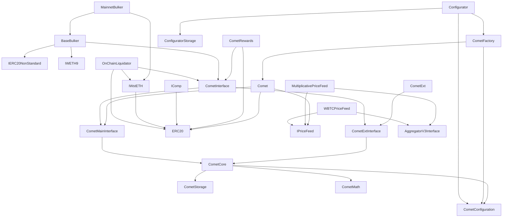
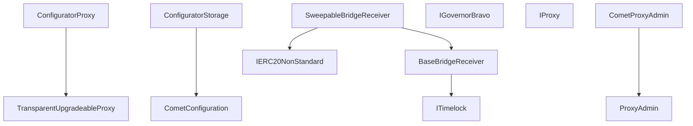

## 依存関係（インポート）のまとめ

```mermaid
graph TD;
    Comet--->CometMainInterface;
    Comet--->ERC20;
    Comet--->IPriceFeed;

    CometCore--->CometConfiguration;
    CometCore-->CometStorage;
    CometCore-->CometMath;

    CometExt--->CometExtInterface;
    CometExtInterface--->CometCore;
    CometFactory--->Comet;
    CometFactory--->CometConfiguration;
    CometInterface--->CometMainInterface;
    CometInterface--->CometExtInterface;

    CometMainInterface--->CometCore;
    CometRewards--->CometInterface;
    CometRewards--->ERC20;

    Configurator--->CometFactory;
    Configurator--->CometConfiguration;
    Configurator--->ConfiguratorStorage;

    IComp--->ERC20;
    IWstETH--->ERC20;


    BaseBulker--->CometInterface;
    BaseBulker-->IERC20NonStandard;
    BaseBulker-->IWETH9;
    MainnetBulker--->BaseBulker;
    MainnetBulker--->IWstETH;

    OnChainLiquidator-->CometInterface;
    OnChainLiquidator-->ERC20;
    OnChainLiquidator-->IWstETH;

    MultiplicativePriceFeed--->IPriceFeed;
    MultiplicativePriceFeed--->AggregatorV3Interface;

    WBTCPriceFeed-->IPriceFeed;
    WBTCPriceFeed-->AggregatorV3Interface;

    

```

```mermaid
graph TD;
    ConfiguratorProxy--->TransparentUpgradeableProxy;
    ConfiguratorStorage--->CometConfiguration;
    CometProxyAdmin--->ProxyAdmin;
    IGovernorBravo;
    IProxy;
    BaseBridgeReceiver-->ITimelock;
    SweepableBridgeReceiver-->IERC20NonStandard;
    SweepableBridgeReceiver-->BaseBridgeReceiver;

```
```
【図について】
インポートの関係を図にした。
インポートする側のコントラクト　➜　インポートされる側のコントラクトを示している。
```
