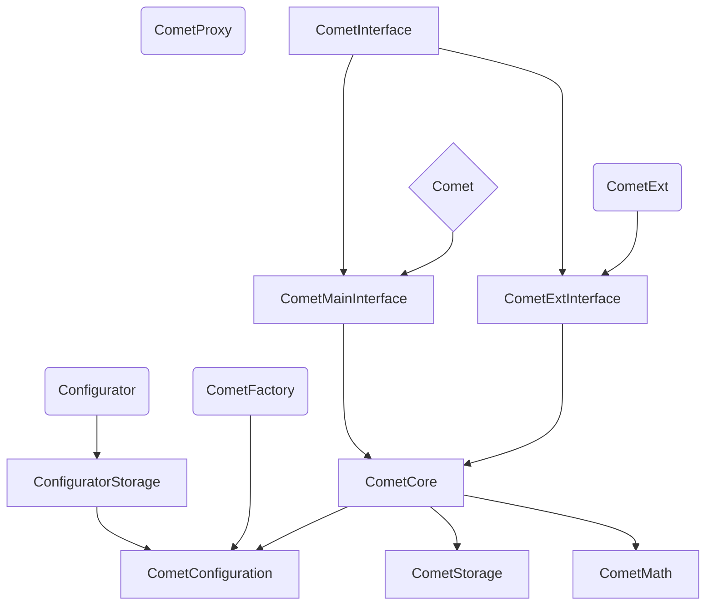
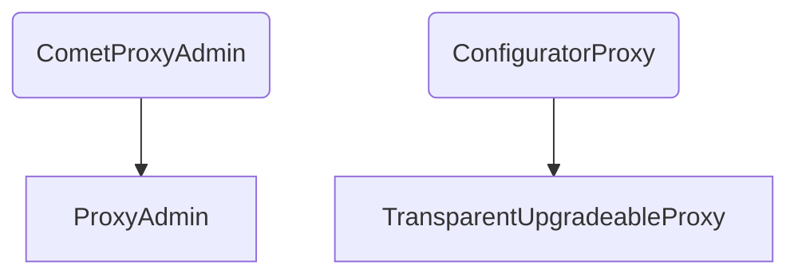
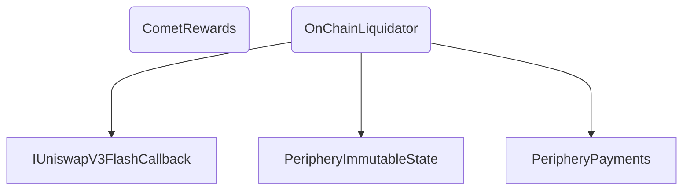
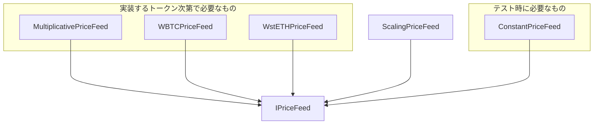
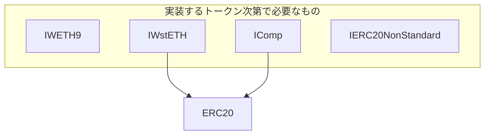
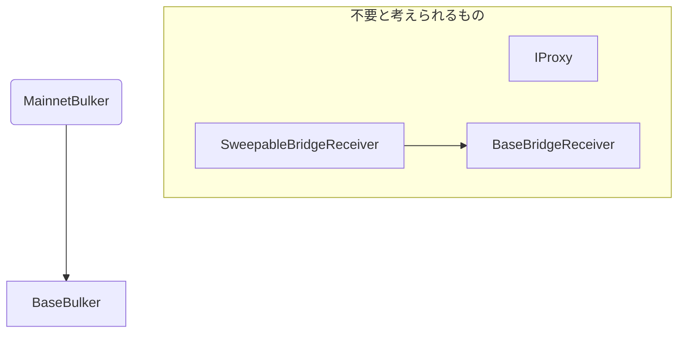
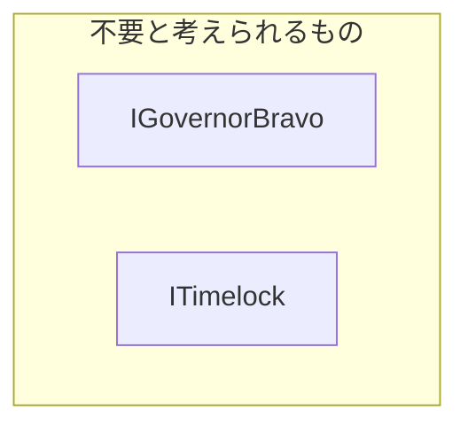

# 依存関係（継承）のまとめ
## 1.cometの主なコントラクト(その1)

## 1.cometの主なコントラクト(その2)

## 2.精算・リワードに関するコントラクト


## 3.プライスフィードに関するコントラクト



## 4.トークンに関するコントラクト

## 5.補助的なコントラクト

## 6.ガバナンスに関するコントラクト


```
【図について】
継承関係を図にした。
派生コントラクト➜基底コントラクトを示している。
(派生コントラクト is 基底コントラクト)
-凡例-
丸四角：デプロイヤー（EOA）がデプロイするもの(確認出来た範囲で丸四角とした)
ひし型：コントラクトからデプロイされるもの
四角形：上記以外のもの
```