# Partial Liquidation — Flowchart

How `CometWithPartialLiquidation` currently handles a liquidation call.

---

## Flowchart

```mermaid
flowchart TD
    A([absorb&#40;absorber, accounts&#41;]) --> B{isAbsorbPaused?}
    B -- yes --> B_err([revert Paused])
    B -- no --> C[accrueInternal]
    C --> D[For each account in accounts]

    D --> E{isLiquidatable&#40;account&#41;}
    E -- no --> E_err([revert NotLiquidatable])
    E -- yes --> F[Load user state:\noldPrincipal, oldBalance, debt in USD]

    F --> G[Get targetHF from extensionDelegate]
    G --> H["Pre-calc loop:\ntotalCollaterizedValue = Σ collateral × price × borrowCF\ntotalCollaterizedValue2 = Σ collateral × price × liquidationFactor"]

    H --> I[For each collateral asset i]

    I --> J{Account holds asset i?}
    J -- no --> I2[next asset]

    J -- yes --> K["Compute for asset i:\nseizeAmount = full balance\ncollateralValue = balance × price\ncollaterizationValue = collateralValue × borrowCF\ncollaterizationValue2 = collateralValue × liquidationFactor\nseizedValue = collateralValue × liquidationFactor"]

    K --> L{Determine branch}

    L -- "totalCV == collaterizationValue\nAND totalCV2 > remaining debt" --> M1[calculation = true]
    L -- "totalCV > collaterizationValue" --> M2["expectedHF =\n&#40;totalCV − collaterizationValue&#41; × FACTOR_SCALE\n÷ &#40;remaining debt − seizedValue&#41;"]
    L -- "totalCV > remaining debt" --> M1
    L -- else --> M3[expectedHF = 0\n&#40;full seizure of this asset&#41;]

    M1 --> N{expectedHF ≥ targetHF\nOR calculation?}
    M2 --> N
    M3 --> N

    N -- yes --> O["requiredCollateralValue = remaining debt × targetHF"]
    N -- no --> P["currentHF = expectedHF\n&#40;seize full asset&#41;"]

    O --> Q{totalCV2 ≥ requiredCollateralValue?}

    Q -- yes --> R["Partial seizure:\nseizedValue = &#40;totalCV2 − requiredCV&#41; × FACTOR_SCALE\n             ÷ &#40;liquidationFactor × targetHF − borrowCF&#41;\nseizeAmount = seizedValue ÷ price\ncurrentHF = targetHF"]
    Q -- no --> S["Full seizure of asset:\nseizeAmount = full balance\nseizedValue = full collateralValue × liquidationFactor\ncurrentHF = 0"]

    R --> T[Update state:\ndeltaValue += seizedValue\ntotalCV −= collaterizationValue\ntotalCV2 −= collaterizationValue2\nUpdate user collateral balance\nEmit AbsorbCollateral]
    S --> T
    P --> T

    T --> U{currentHF ≥ targetHF?}
    U -- yes --> V[break — target health factor reached]
    U -- no --> I2

    I2 --> I

    V --> W
    I -- end of assets --> W

    W["Compute newBalance:\nnewBalance = oldBalance + deltaValue ÷ basePrice\nIf newBalance < 0 AND currentHF < targetHF → newBalance = 0"]
    W --> X[Update user principal\nUpdate totalSupplyBase / totalBorrowBase\nEmit AbsorbDebt]
    X --> D
    D -- all accounts done --> Y([done])
```



---

## Notes on the diagram

- The `totalCV2 >= requiredCollateralValue` guard (before the partial seizure formula) was added as a fix for a numerator underflow bug. Without it, when collateral value at `liquidationFactor` is less than `debt × targetHF`, the subtraction panics. The fallback path seizes all remaining collateral and sets `currentHF = 0`.
- `collaterizationValue2` (the per-asset value subtracted from `totalCV2` each iteration) uses `liquidationFactor`, consistent with how `totalCV2` is pre-computed. An earlier version incorrectly used `liquidateCollateralFactor`, which caused underflows in multi-asset scenarios.

---

## Key variables

| Variable | Description |
|---|---|
| `totalCollaterizedValue` | Sum of `collateralValue × borrowCollateralFactor` across all user assets (borrow-weighted) |
| `totalCollaterizedValue2` | Sum of `collateralValue × liquidationFactor` across all user assets (liquidation-weighted) |
| `collaterizationValue` | `borrowCollateralFactor`-weighted value of the current asset only |
| `collaterizationValue2` | `liquidationFactor`-weighted value of the current asset only |
| `seizedValue` | Liquidation-factor-adjusted value of collateral actually taken |
| `deltaValue` | Accumulated `seizedValue` across all seized assets so far |
| `expectedHF` | Projected health factor if this entire asset were skipped |
| `currentHF` | Actual health factor achieved after seizing this asset |
| `targetHF` | Desired health factor post-liquidation, set via `ConfiguratorPartialLiquidation` |
| `requiredCollateralValue` | Collateral value required at `liquidationFactor` weighting to reach `targetHF` |

---

## Partial seizure formula

When the target health factor can be achieved with a partial seizure of the current collateral asset:

```
seizedValue = (totalCV2 − debt × targetHF) × FACTOR_SCALE
              ─────────────────────────────────────────────
              liquidationFactor × targetHF − borrowCF
```

The denominator requires `liquidationFactor × targetHF > borrowCF`, otherwise the transaction reverts (see revert cases doc).
